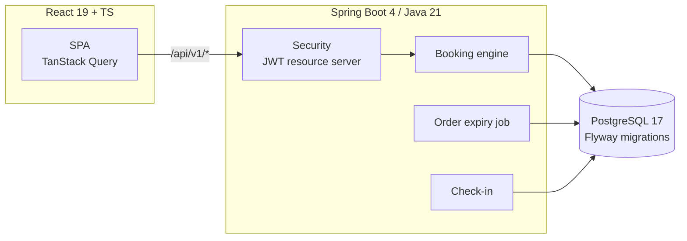

# EventPulse v2

Event ticketing platform built around the hard parts of ticketing: **selling
the last 10 tickets to 500 people at once without overselling**, idempotent
checkout, QR gate check-in, and waitlists.

This is a ground-up re-architecture of [EventPulse v1](https://github.com/Chandu6702/EventPulse)
(MERN event dashboard). v1 managed events; v2 sells tickets — which turns the
project from CRUD into a concurrency problem, and that drove the move to
Java/Spring + PostgreSQL.

## Architecture



## The interesting problems

| Problem | Solution |
|---|---|
| Overselling under concurrent load | Conditional `UPDATE … WHERE available >= qty` — the write *is* the availability check. A `CHECK (sold + held <= capacity)` constraint is the database-level backstop. Proven by an integration test that fires 20 concurrent buyers at 10 tickets. |
| Double-charging on retries | `Idempotency-Key` header; replays return the original order. Unique `(user_id, key)` constraint as the backstop. |
| Abandoned checkouts hoarding tickets | Pending orders hold inventory for 10 min; a scheduled sweeper expires them (each in its own transaction) and releases the holds. |
| Confirm/expire race | Both paths lock the order row first (`SELECT … FOR UPDATE`); state transitions are checked under the lock. |
| Deadlocks on multi-item orders | Items are processed in deterministic ticket-type order in every transaction. |
| Same QR scanned at two gates | Locked ticket lookup — exactly one scan wins, the other gets the original check-in time. |
| Stolen refresh tokens | Tokens are opaque, stored as SHA-256 hashes, rotated on every use; reusing a rotated token revokes the whole session family. |
| Sold-out demand | Waitlist with row-locked FIFO promotion when inventory is released. |

## Stack

**Backend** Java 21 · Spring Boot 4 · Spring Security (OAuth2 resource server, HS256) · Spring Data JPA · PostgreSQL 17 · Flyway
**Frontend** React 19 · TypeScript · Vite · TanStack Query · Tailwind CSS 4
**Testing** JUnit 5 · Testcontainers (real PostgreSQL in tests)
**Infra** Docker · GitHub Actions · Terraform (AWS ECS Fargate + RDS + ALB — [validated but intentionally not deployed](infra/terraform/README.md))

## Run it locally

Prerequisites: JDK 21+, Node 20+, Docker.

```bash
# API on :8080 — Postgres starts automatically via docker-compose
cd backend && ./mvnw spring-boot:run
```

```bash
# SPA on :5173, proxying /api to :8080
cd frontend && npm install && npm run dev
```

Or the full production-like stack (nginx + api + db):

```bash
JWT_SECRET=dev-only-secret-0123456789abcdef docker compose -f docker-compose.prod.yml up --build
```

Try it: register as an organizer → create an event + ticket types → publish →
register as an attendee in another browser → book (watch the 10-minute hold
countdown) → pay (mocked) → ticket QR appears under *My tickets* → check it in
from the organizer's *Check-in* console — scanning twice is rejected.

## Tests

```bash
cd backend && ./mvnw verify   # needs Docker for Testcontainers
```

The suite that matters: [`BookingConcurrencyIntegrationTest`](backend/src/test/java/com/eventpulse/order/BookingConcurrencyIntegrationTest.java)
— 20 threads race for 10 tickets and exactly 10 orders may win, verified
against a real PostgreSQL container. Also covered: idempotent replay,
hold→sale conversion, expiry + waitlist promotion, refresh-token reuse
detection, double-scan rejection.

## API surface (v1)

| Area | Endpoints |
|---|---|
| Auth | `POST /auth/register` · `/auth/login` · `/auth/refresh` · `/auth/logout` |
| Catalogue | `GET /events` (search, city, category, date filters) · `GET /events/{id}` |
| Organizer | `POST /events` · `PATCH /events/{id}` · `POST /events/{id}/publish` · `/cancel` · ticket-type CRUD · `GET /events/mine` |
| Booking | `POST /orders` (Idempotency-Key) · `POST /orders/{id}/confirm` · `/cancel` · `GET /orders` |
| Tickets | `GET /tickets` · `POST /check-in` · `POST /ticket-types/{id}/waitlist` |

Design decisions and trade-offs are documented in [docs/DESIGN.md](docs/DESIGN.md).

## License

[MIT](LICENSE)
